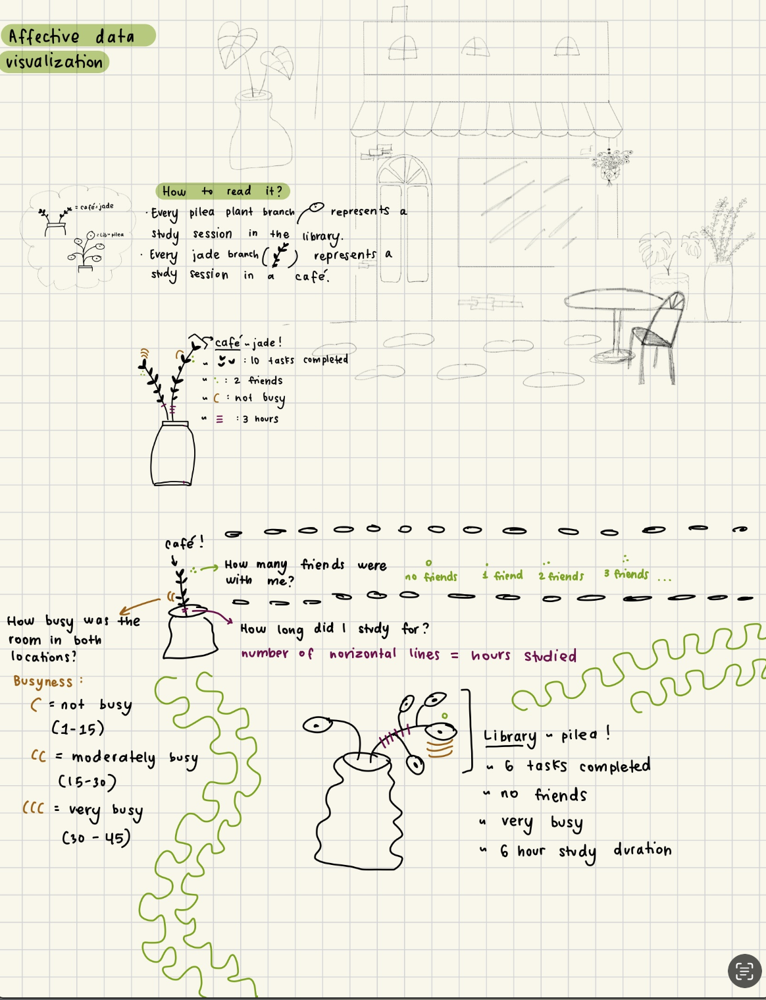
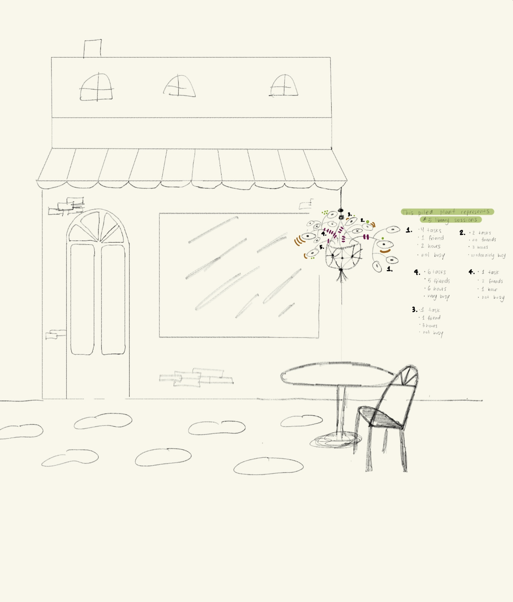
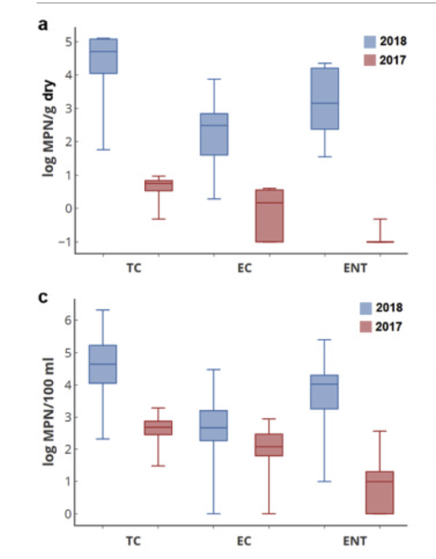

[GitHub Repository](https://github.com/bellakormos/ENVS-193DS_homework-03) \# Homework Set Up

Reading in packages:

```{r}
#| label: packages
#| message: false
library(tidyverse) # load in all packages
library(janitor)
library(here) # identifies computer's root folder
library(lubridate)

```

Reading in data:

```{r}
#| label: reading in data
#| message: false
salinity <- read_csv(here("data", "salinity-pickleweed.csv")) # store the data and save object as "salinity" 
my_data <- read_csv(here("data", "updated_personal-data.csv")) # Read in the personal data as an object named "my_data"

```

# Problem 1. Slough soil salinity

## a. An appropriate test

To determine the strength of the relationship between salinity and California pickleweed biomass, the two appropriate tests are the Pearson correlation and Spearman correlation tests. The pearson correlation (correlation coefficient, r) measures the strength between soil salinity and biomass. The pearson test is a parametric test that assumes variables are continuous, normally distributed, and have independent observations. The Spearman rank correlation is a non-parametric test that measures the stength of the monotonic relationship between ranked values of soil salinity and biomass, and it does not assume normality.

## b. Create a visualization

```{r}
#| label: create visualizaiton
#| message: false
# base layer: ggplot
ggplot(data = salinity, # using salinity data frame
       aes(x = salinity_mS_cm, # soil salinity on x-axis (predictor)
           y = pickleweed)) + # pickleweed biomass on y-axis (response)
  # first layer: make scatter-plot 
  geom_point(color = "forestgreen",
             alpha = 0.7, # slight transparency 
             size = 2) + # slightly larger points
  # title plot, x-axis, y-axis
  labs(x = "Soil Salinity (mS/cm)", 
       y = "Pickleweed Biomass (g)",
       title = "Relationship between Soil Salinity and Pickleweed Biomass") +
  theme_light() # different from default theme
```

## c. ### Assumption Checks Check and Run Test
**Check 1: Visualization - Linearity  **
```{r}
#| label: visualizaiton assumption check
#| message: false
# base layer: ggplot
ggplot(data = salinity, # using salinity data frame
       aes(x = salinity_mS_cm, # soil salinity on x-axis (predictor)
           y = pickleweed)) + # pickleweed biomass on y-axis (response)
  # first layer: make scatter-plot 
  geom_point(color = "forestgreen",
             alpha = 0.7, # slight transparency 
             size = 2) + # slightly larger points
  # title plot, x-axis, y-axis
  labs(x = "Soil Salinity (mS/cm)", 
       y = "Pickleweed Biomass (g)",
       title = "Relationship between Soil Salinity and Pickleweed Biomass") +
  theme_light() # different from default theme
```

**Check 2: QQ plot - Normal Distribution  **
```{r}
#| label: QQ plot for salinity
#| message: false

# base layer: ggplot using salinity data
ggplot(data = salinity,
       aes(sample = salinity_mS_cm)) +
  # second layer: qq line and points
  geom_qq_line(color = "darkgreen") +  # add theoretical normal reference line
  geom_qq() + # add points comparing sample quantiles to theoretical normal quantiles
  # add title, and axes labels 
  labs(
    title = "QQ Plot of Soil Salinity",
    x = "Theoretical Quantiles",
    y = "Sample Quantiles") +
  # add new theme
  theme_light()
```


```{r}
#| label: QQ plot for biomass
#| message: false

# base layer: ggplot using salinity data
ggplot(data = salinity,
       aes(sample = pickleweed)) + # check normality of biomass variable
  # second layer: qq line and points
  geom_qq_line(color = "darkgreen") + # green reference line for easier visualization
  geom_qq() + # plots sample quantiles against theoretical normal quantiles
  labs(
    title = "QQ Plot of Pickleweed Biomass", # descriptive title
    x = "Theoretical Quantiles", # x axis label
    y = "Sample Quantiles") + # y axis label
  theme_light() # non-default theme
```
Assumption visual checks: To determine whether the Pearson correlation test was appropriate, the normality of both variables and the linearity of the relationship between them was determined. Normality was assessed visually by using the QQ plots for for both soil salinity (mS/cm) and pickleweed biomass (g). Linearity was assessed visually with a scatterplot of the two variables. Since the points on the QQ plots for both variables approximately follows the theoretical distribution reference lines with only minor deviations at the tails, both variables are approximately normally distributed. The scatterplot shows a linear pattern between soil salinity and pickleweed biomass, confirming that the linearity assumption is met and that a Pearson correlation test is appropriate.

### Running the Test

```{r}
#| label: pearson correlation
#| message: false

# run Pearson correlation between soil salinity and pickleweed biomass
cor.test(salinity$salinity_mS_cm, # predictor: soil salinity
         salinity$pickleweed, # response: pickleweed biomass
         method = "pearson") # parametric correlation test
```

## d. Results communication

To evaluate the strength of the relationship between pickleweed biomass and soil salinity, I used a Pearson's product-moment correlation. We found a moderate positive relationship between soil salinity and pickleweed biomass (Pearson’s r = 0.53, t(21) = 2.9, p = 0.01, ⍺ = 0.05), which suggests that pickleweed biomass tends to increase as soil salinity increases along the slough.

## e. Test implications

Our analysis found a moderate positive relationship between soil salinity and pickleweed biomass at this restoration site, which means that in higher salinity soils, pickleweed is growing with a greater biomass. This ultimately suggests that saltier conditions are beneficial for the growth of pickleweed, which makes sense since it is a salt-tolerate species. To ensure pickleweed planting success, planting should be prioritized in higher salinity areas of the slough.

## f. Double check your own work.

```{r}
#| label: spearman tests
#| message: false

# run Spearman rank correlation as a comparison to Pearson
cor.test(salinity$salinity_mS_cm, # predictor is salinity
         salinity$pickleweed, # response is pickleweed biomass
         method = "spearman") # non-parametric rank-based correlation
```

To evaluate the strength of the relationship between pickleweed biomass and soil salinity, I used a Spearman's rank correlation rho. We found a moderate relationship between soil salinity and pickleweed biomass (Spearman p = 59, S = 824, p = 0.003, α = 0.05), which suggests that pickleweed biomass tends to increase as soil salinity increases along the slough. Both tests agree that the relationship is moderate and positive, so the result is robust with both correlation methods.


# Problem 2. Personal data

## a. Updating your visualizations

### Continuous variable visualization: Time duration vs Tasks completed

```{r}
#| label: continuous variable visualization
#| message: false
my_clean_data <- my_data |> # use cleaned data-set
  clean_names() |> # clean column names
  rename(duration = duration_hr_mm) |> # rename for easier use
  filter(duration != "48:00:00") |> # remove the typo entry
   # convert all durations to decimal point instead of ":"
   mutate(duration_decimal = case_when(
    str_detect(duration, "\\.") ~ as.numeric(duration), # if format is 4.18, keep as numeric
    str_detect(duration, ":") ~ period_to_seconds(hm(duration)) / 3600 # if format is 1:43, convert to decimal
  )) 
# base layer: ggplot
ggplot(
  data = my_clean_data,
  aes(x = duration_decimal, # predictor var: duration
      y = tasks_completed)) + # response var: tasks completed
  # first layer: scatter-plot
  geom_point(color = "forestgreen", # green points
             size = 2, 
             alpha = 0.7) + # slight transparency 
  # create readable labels, ticks every hour for clarity 
  scale_x_continuous(breaks = seq(0, 6, by = 1), # tick every hour
                     labels = c("0h", "1h", "2h", "3h", "4h", "5h", "6h")) + 
  # title plot, x-axis, y-axis
  labs(title = "Analyzing productivity:\nTasks Completed vs. Study Duration",
       x = "Study Duration (hours)",
       y = "Tasks Completed",
    subtitle = "Most recent observation: March 1, 2026") + # most recent date
  # add clean themes and remove minor grid lines
  theme_minimal() + 
  theme(panel.grid.minor = element_blank()) 
```

### Categorical variable visualization: vs Tasks completed

```{r}
#| label: categorical-variable-visualization
#| message: false
my_clean_data <- my_data |> 
  clean_names() # columns names lower case with underscores
# base layer: ggplot using cleaned data-set
ggplot(data = my_clean_data, 
      aes(x = study_location, # categorical predictor on x-axis
          y = tasks_completed, # response variable on y-axis
          fill = study_location)) + 
  # add a cap at whisker end for visual appeal
  stat_boxplot(
    geom = "errorbar", # adds horizontal caps at whisker ends
    width = 0.02) + # width os the caps
  # first layer: boxplot 
  geom_boxplot(alpha = 0.6, # make boxplot transparent 
               width = 0.4) + 
  # second layer: add jittered points 
  geom_jitter(width = 0.1, # horizontal spread to avoid overlap
              alpha = 0.7, # semi-transparent points
              size  = 2) + # point size
    scale_fill_manual(values = c("Café" = "#FEBC11", # warm gold for café
                                 "Library" = "#4169E1")) + # muted blue-green for library
    scale_y_continuous(breaks = seq(0, 12, by = 2), limits = c(0, 13)) + # set  y-axis tick marks every 2 tasks for clarity
    # add title and axis labels    
    labs(title = "Analyzing productivity:\nTasks Completed vs. Study Location",
           x = "Study Location",
           y = "Tasks Completed",
  subtitle = "Most recent observation: March 1, 2026") + # add subtitle with date
  # set theme, remove legend, remove minor grid lines
  theme_minimal() + 
  theme(legend.position = "none") + 
  theme(panel.grid.minor = element_blank(), 
        panel.grid.major.x = element_blank())
```

## b. Captions

Figure 1. The relationship between study duration (hours) and tasks completed across all study sessions is represented in a scatter-plot. The most recent observation was March 1, 2026, and each green point reperesents a study session.

Figure 2. The distribution of tasks completed by study location (Café vs Library) across study sessions is represented by the boxplot. Each black point is a study session. The library (in blue) has higher median (around 5 tasks), while Café study sessions (gold) has a smaller IQR and median.


# Problem 3. Affective visualization

## a. Describe in words what an affective visualization could look like for your personal data (3-5 sentences).

To represent my personal data measuring productivity in cafés vs libraries, I will draw inspiration from the Stefanie Posavec and Giorgia Lupi’s Dear Data project. My vision for this affective visualization is to combine some of my interests: houseplants, café culture, and doodling! I plan on creating a background setting of a café (relatively basic), and then add plants in the café and around it that represent data points. Each branch coming from the plant pot can represent a study session, differentiating study location with different plant species, say pileas vs jade plants. Each plant can have different doodles to show each variable I measured including: number of tasks completed, number of friends with me, busyness of location, and duration of study session.

## b. Create a sketch of your idea.

 

## c. Make a draft of your visualization.

## d. Write an artist statement.

My project shows my productivity levels in terms of tasks completed during various study sessions in Libraries vs Cafés. My piece is a watercolor drawing and painting of a café with pilea and jade plants. Each branch of each plant represents a different data observation/study session, with doodles representing other variables involved. The major influences of my work include my love of watercolor, houseplants, café culture, and Giorgia Lupi’s Dear Data project. I have started sketching overall ideas of my work, then I will get watercolor paper, sketch out the final drawing with pencil, water color a base, and finally use a pen to go over all the plants and drawings in permanent black ink.

## e. Prep your materials to share in class.

**In your homework submission, include a “View” link to your slides as a hyperlink.**


# Problem 4. Statistical critique

## a. Revisit and summarize

The authors investigate whether emergency beach nourishment using contaminated urban debris-flow sediments lead to elevated fecal indicator bacteria (FIB) in the surf zone at Goleta Beach. The authors hypothesized that these disposed sediments contaminated with human fecal material changed Goleta Beach’s surf microbiology and can inform future public health protection.

 \## b. Visual clarity The authors represent their statistics through side-by-side box-plots comparing three different types of fecal indicator bacteria(TC, EC, ENT) in 2017 and 2018. Panel a represents the log- transformed concentration of FIB in log MPN/g in dry sediment, while panel c represents the concentration of FIB in log MPN/100 mL in water, which ultimately shows how FIB concentrations increased during the 2018 sediment disposal event relative to the 2017 reference conditions. The x and y-axes are logically positioned with the bacteria type on x-axis, and log-transformed concentration on the y-axis, the medians and IQR are well represented. However, the y-axis title is quite confusing, and the FIB types are unknown without reading the figure caption.

## c. Aesthetic clarity

The figure has a plain white background, minimal gridlines, and a simple 2-color scheme (blue for 2018 and red for 2017). These components reduce visual clutter and make the year comparison readable and clear. The plots have high data:ink ratio, however the lack of definition of the FIB types (TC, EC, ENT) is confusing.

## d. Recommendations

In panel a, to improve the clarity of the y-axis lable, I would change the figure caption from "log MPN/g dry" to "Fecal Indicator Bacteria Concentration (log MPN/g dry). In panel c, I would change the title from "log MPN/100 mL" to "Fecal Indicator Bacteria Concentration (log MPN/100 mL water). This clarifies the sample type and adds context to the units. I would also add a figure legend below or next to the year legend writing out the full names of the FIB types (Total Coliform, E. coli, Enterococci). This makes it easier to understand the abbreviations so the reader doesn't have to read the caption to understand which FIB types are being measured.
